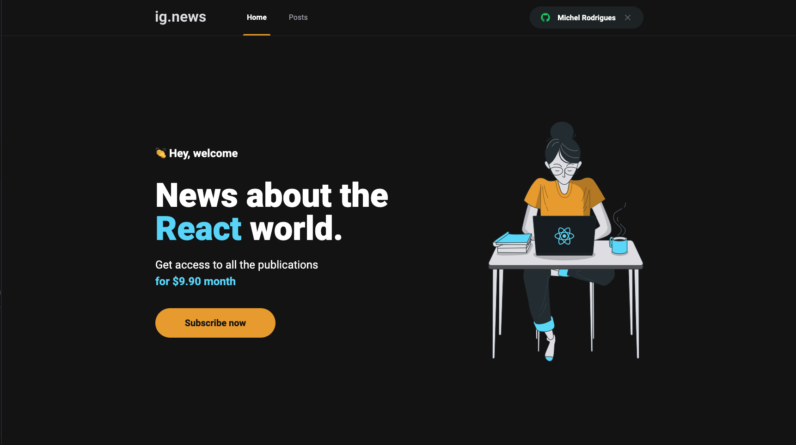
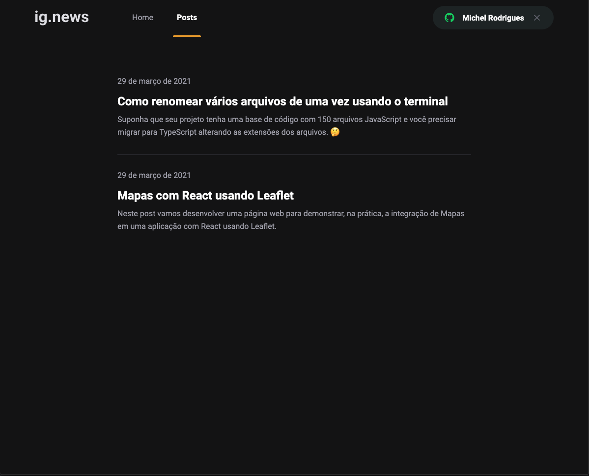

# ig.news

<p align="center">
  
  
</p>

<p align="center">
   
  
</p>

## Techs

* [React.js](https://pt-br.reactjs.org/)
* [Next.js](https://nextjs.org/)
* [Stripe](https://stripe.com/en-br)
* [FaunaDB](https://fauna.com/)
* [Prismic](https://prismic.io/)

## Instalação

```sh
$ yarn install
```

## Setup

```sh
$ cp .env.example .env.local
```
